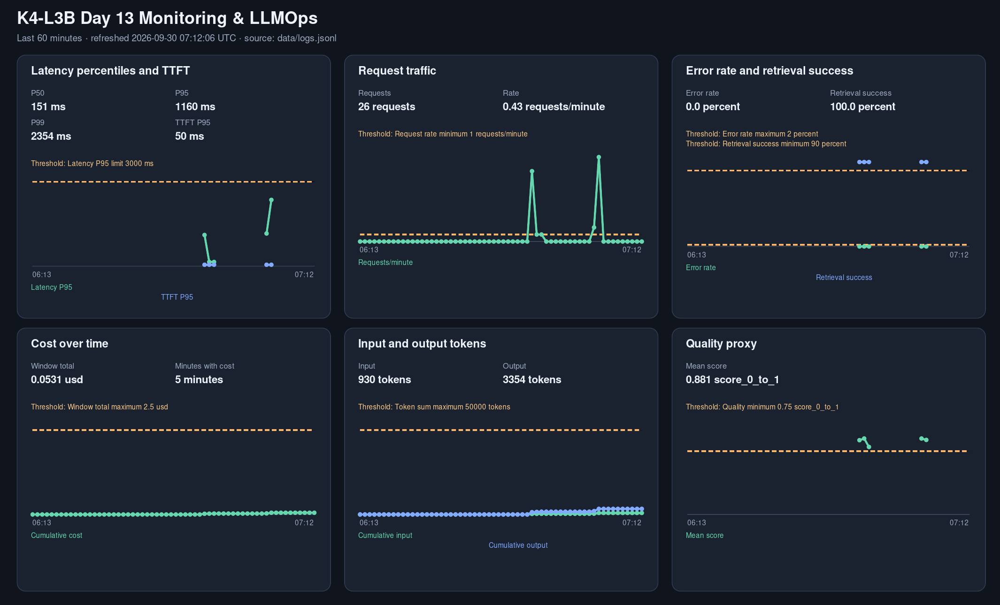

# Báo cáo cá nhân — K4-L3B Day 13 Monitoring & LLMOps

> Mỗi học viên hoàn thiện một file duy nhất này. Khi dẫn evidence, dùng đường dẫn tương đối, ví dụ `evidence/07-trace-waterfall.png`.

## 1. Thông tin học viên

- **Họ và tên:** Tran Nam Anh
- **MSSV:** 2A202602901
- **Lớp:** K4-L3B
- **Repository URL:** https://github.com/trnamanh12/K4-L3-DAY13-TranNamAnh-2A202602901-Monitoring-LLMOps
- **Commit SHA cuối:** `7784d1d2355728f97281822629633b38733f6fb6` (last committed HEAD; CP4 evidence/report updates are pending commit).
- **Challenge ID:** `day13-k4-l3b-monitoring-llmops-v1`
- **Tên project Langfuse cá nhân:** `day13-k4-l3b-2A202602901`.

## 2. Evidence index

Điền đúng đường dẫn tới evidence thực tế. Có thể đổi tên hoặc dùng nhiều ảnh nếu cần.

| Evidence | Đường dẫn |
|---|---|
| Pytest cuối | `evidence/01-pytest.txt` |
| Log validator | `evidence/02-log-validator.txt` |
| Dashboard validator | `evidence/03-dashboard-validator.txt` |
| Structured log | `evidence/04-structured-log.txt` |
| PII redaction | `evidence/05-pii-redaction.txt` |
| Trace list | `evidence/06-trace-list.txt` |
| Trace waterfall | `evidence/07-trace-waterfall.txt` |
| Trace root metadata | `evidence/08a-trace-root-metadata.txt` |
| Generation metadata | `evidence/08b-generation-metadata.txt` |
| Prompt versions | `evidence/09-prompt-versions.txt` |
| Prompt rollback | `evidence/10-prompt-rollback.txt` |
| Dashboard runtime | `evidence/11-dashboard-overview.png` |
| Incident metric | `evidence/12-incident-metric.png` |
| Incident log | `evidence/13-incident-log.txt` |
| Incident trace | `evidence/14-incident-trace.txt` |

## 3. Kết quả kỹ thuật

| Nội dung | Baseline | Kết quả cuối | Nhận xét |
|---|---|---|---|
| `validate_logs.py` | 30/100 (`data/logs_baseline.jsonl`) | 100/100 | API runtime logs have required metadata and no detected PII. |
| `validate_dashboard.py` | Chưa ghi nhận | 6/6 panel | Runtime page lấy dữ liệu từ `data/logs.jsonl`, time range 60 phút, refresh 30 giây. |
| `pytest` | Chưa ghi nhận | 25 passed | `.venv/bin/python -m pytest -q` |
| Số traces hợp lệ | | 31 trace capture-safe đã kiểm chứng | 14 CP2, 15 CP3 baseline/challenge, 2 CP4 evidence requests; có root + retrieval + generation. |
| Số PII leak | 0 | 0 | Validator và isolated API run. |
| Latency P95 / TTFT P95 | | 2,651 ms / 50 ms | 17 request: 10 baseline, 5 challenge, 2 CP4 cross-check requests. |
| Retrieval success rate | | 100% | 17/17 tool result thành công; incident làm chậm retrieval nhưng không làm retrieval fail. |

## 4. Logging và PII

- **Cách tạo/nhận và truyền correlation ID:** Middleware xóa context cũ, nhận `x-request-id` nếu khớp `req-<8 hex>` hoặc tạo ID mới, rồi bind ID vào contextvars. ID cũng có trong response header và body `/chat`.
- **Các metadata được ghi vào structured log:** `user_id_hash` (SHA-256 rút gọn), `session_id`, `feature`, `model`, `env`; middleware thêm `correlation_id`.
- **Cách bảo đảm PII được scrub trước khi ghi:** `scrub_event` chạy trước file writer và JSON renderer, đệ quy qua các chuỗi trong event; các pattern scrub email, điện thoại Việt Nam, CCCD 12 số và thẻ 16 số.
- **Cách kiểm chứng kết quả:** `validate_logs.py` đạt 100/100; request `req-c4e5f6a7` có cùng ID ở response header/body, hai log event và trace. Request `req-c4e5f6b8` kiểm tra PII tổng hợp; log chỉ có marker redaction. Xem [validator](evidence/02-log-validator.txt), [structured log](evidence/04-structured-log.txt) và [PII redaction](evidence/05-pii-redaction.txt).

## 5. Tracing và prompt versioning

- **Cách xác nhận traces do chính tôi tạo trong project cá nhân:** Project `day13-k4-l3b-2A202602901` đã được xác nhận qua Langfuse API. Trace IDs trong [trace list](evidence/06-trace-list.txt), [incident trace](evidence/14-incident-trace.txt), và log/trace proof [04](evidence/04-structured-log.txt) đều từ workload kiểm tra cá nhân.
- **Cấu trúc root/retrieval/generation observations:** Root `lab-agent-run` có hai child observations dùng `@observe`: `retrieval` loại `RETRIEVER` và `generation` loại `GENERATION`. Cả ba decorator đều tắt capture input/output. Generation lưu prompt link, model, usage, cost và TTFT; xem [waterfall](evidence/07-trace-waterfall.txt), [root metadata](evidence/08a-trace-root-metadata.txt) và [generation metadata](evidence/08b-generation-metadata.txt).
- **Cách nối trace với log:** `req-c4e5f6a7` khớp giữa response, `request_received`, `response_sent`, root metadata và trace `4a6aaa48f77341159ed0fca78040bee3`; 07/08a/08b đều trỏ tới trace này.
- **Prompt name:** `day13-chat`.
- **Version/label baseline:** v1, labels `baseline` và `production` ở trạng thái cuối.
- **Version/label candidate:** v2, label `candidate`.
- **Trace ID của mỗi version:** baseline v1 `1a0f733cb5f64666c6f1fdcc7e8d5d1c`; candidate v2 `9bc83cd67744cf56680562e6431d829d`; production v2 trước rollback `067e5d141b3d3d2f94324c88e4d9e7bd`; production v1 sau rollback `9926caa500e35283f323ffd16ba6d106`.
- **Cách promote và rollback `production`:** Đổi label trong Langfuse SDK v4, restart API ở mỗi trạng thái và gửi cùng input. Production đã được kiểm tra trên v2 rồi rollback về v1. Chi tiết: [prompt versions](evidence/09-prompt-versions.txt) và [rollback](evidence/10-prompt-rollback.txt).

## 6. Dashboard, SLO và alerts

- **Dashboard và sáu panel:** Chạy `python scripts/dashboard.py`, mở `http://127.0.0.1:8001`. Dashboard local refresh 30 giây, lấy log trong 60 phút và vẽ chuỗi theo phút cùng threshold line cho latency P50/P95/P99 + TTFT P95, traffic, error/retrieval success, cost, tokens và quality. Contract: `config/dashboard.yaml`; [ảnh dashboard](evidence/11-dashboard-overview.png) và [runtime metrics](evidence/11-dashboard-runtime.json); validator: [6/6](evidence/03-dashboard-validator.txt).

- **SLO và lý do chọn:** `fast_successful_requests` mục tiêu 99.5% trong 28 ngày, latency tối đa 3,000 ms. CP1 baseline có P95 950 ms và TTFT P95 50 ms trên 10 response; 3,000 ms giữ khoảng đệm cho tail latency. Chi tiết: `config/slo.yaml`.
- **Cách tính error budget:** 100% − 99.5% = 0.5%; trên 10,000 request trong 28 ngày, tối đa 50 request được phép lỗi hoặc vượt 3,000 ms.
- **Ba alert và runbook tương ứng:** `HighLatencyP95` (>2,000 ms/5m, cảnh báo sớm trước SLO 3,000 ms), `RequestErrorsOrRetrievalFailures` (error >2% hoặc retrieval success <90%/5m), `DailyCostBudget` (daily cost >2.50 USD/10m). Cả ba gửi Slack `#k4-l3b-alerts`; runbook tại [docs/alerts.md](../docs/alerts.md).

> Ví dụ cách viết error budget: "SLO 99.5% trong 28 ngày nghĩa là error budget 0.5%. Nếu workload có 10,000 request thì tối đa 50 request được phép lỗi hoặc chậm hơn ngưỡng SLO."

## 7. Điều tra challenge

- **Challenge ID:** `day13-k4-l3b-monitoring-llmops-v1` (cohort K4; dùng file chính thức từ Lab Coach, không commit file challenge).
- **Khoảng thời gian điều tra:** Baseline 11:49:55–11:49:56 UTC; incident 11:50:04–11:50:17 UTC.
- **Triệu chứng từ metrics:** 10 baseline request có latency P95 151 ms; 5 request khi `rag_slow` bật có P95 2,651 ms, cả 5 đều vượt challenge threshold 2,000 ms. Retrieval success 5/5, error 0. Xem [incident metrics](evidence/12-incident-metric.txt) và [dashboard snapshot](evidence/12-incident-metric.png).
- **Log line và correlation ID liên quan:** `response_sent` cho `req-5960db20` ghi `latency_ms=2651`, `tool_success=true`; log baseline/incident có trong [incident log](evidence/13-incident-log.txt).
- **Trace ID và span gây ảnh hưởng:** Trace `5f069d236dd494d958ecf20dcf9e2a47`, cùng `correlation_id=req-5960db20`. Span `retrieval` mất 2.500 s, generation mất 0.151 s; xem [incident trace](evidence/14-incident-trace.txt).
- **Root cause:** Incident challenge bật `rag_slow`, làm `retrieve()` thêm 2.5 giây; trace so sánh baseline/challenge cho thấy retrieval tăng từ khoảng 1 ms lên 2.5 s, còn generation giữ khoảng 0.15 giây. Một lượt thăm dò trước khi làm sạch log có outlier cold-prompt; lượt đó không nằm trong baseline/challenge CP3 sạch ở trên.
- **Fix action:** Tắt incident sau khi thu thập bằng `python scripts/inject_incident.py --disable`; `/health` xác nhận cả ba incident đều `false`.
- **Preventive measure:** Hạ alert `HighLatencyP95` xuống >2,000 ms trong 5 phút (baseline CP3 P95 151 ms) để cảnh báo trước SLO 3,000 ms; runbook yêu cầu nối dashboard → correlation ID trong log → trace retrieval/generation.

> Gợi ý cách viết ngắn, không thay cho evidence thực tế: "Metric cho thấy `[latency/error/cost/quality]` bất thường trong `[khoảng thời gian]`. Log line `[event]` có `correlation_id=[...]` đại diện cho request bị ảnh hưởng. Trace cùng `correlation_id` cho thấy span `[retrieval/generation/prompt/tool]` có dấu hiệu `[chậm/lỗi/token tăng]`. Root cause là `[nguyên nhân suy ra từ evidence]`. Fix action là `[hành động khôi phục]`; preventive measure là `[alert/runbook/test/guardrail để ngăn tái diễn]`."

## 8. Giải thích và tự đánh giá

- **Một quyết định kỹ thuật quan trọng và lý do:** Dùng label thay vì hard-code prompt version để workload nhận đúng managed prompt và có thể rollback không đổi code.
- **Một lỗi/blocker đã gặp:** Trace list endpoint cũ trả HTTP 410 cho tổ chức Langfuse mới.
- **Cách tìm nguyên nhân và xử lý:** Chuyển sang Observations API v2, truy vấn bounded time range, rồi group observations theo `trace_id` để kiểm chứng cây span.
- **Hạn chế hoặc phần chưa hoàn thành, nếu có:** 31 trace được chọn cho CP2/CP3/CP4 có input/output rỗng; 72 observation cũ còn input/output đã scrub và không có PII detector hit. CUA không có browser/app surface nên ảnh Langfuse UI và terminal 04–10/13–14 còn thiếu. CP4 report/evidence edits chưa commit.
- **Cách hiểu luồng Metrics → Logs → Traces:** Dashboard cho thấy thời điểm và mức latency tăng; `correlation_id` lọc đúng `response_sent`; trace cùng ID cho thấy retrieval chậm 2.5 s còn generation 0.151 s.
- **Vai trò của prompt version, token/cost, SLO hoặc rollback trong vận hành LLM:** Prompt label giúp promote/rollback không cần sửa code; generation usage/cost làm rõ chi phí theo request; error budget và alert đặt ngưỡng vận hành cụ thể.
- **Điều quan trọng nhất đã học:** Chỉ kết luận root cause sau khi metric, log và span của cùng correlation ID cùng chỉ về một bước.

## 9. Checklist trước khi nộp

- [x] Kết quả và evidence thuộc commit SHA cuối.
- [x] Tất cả ảnh/output mở được bằng đường dẫn tương đối.
- [x] Incident evidence nối đúng metric → log → trace.
- [x] Trace/prompt evidence thuộc project Langfuse cá nhân và ảnh UI không lộ key/secret. (API/text evidence có; screenshot UI còn thiếu.)
- [x] Repository chạy lại được theo README.
- [x] Không có secret, API key, PII thô hoặc evidence của người khác/lớp khác.
- [x] URL repo và commit SHA cuối đã được nộp trên LMS/Codelabs.
